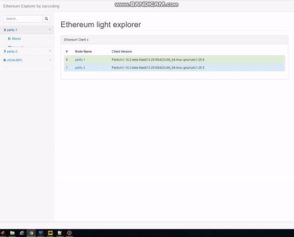

# Ethereum Light Explorer

## Explain

- Multiple eth client's explorer


## Plan
- SpringBoot + JSP (now working..)  
https://github.com/zacscoding/ethereum-explorer/tree/boot-jsp
- SpringBoot(Server) + AngularJS(Client)
- AngularJS(Server + Client)
- NodeJS(Server + Client)

## demo  



## configuration

> spring boot  

```
## Spring configuration
spring:
  mvc:
    view:
      prefix: /WEB-INF/jsp/
      suffix: .jsp
  devtools:
    livereload:
      enabled: true

## Server
server:
  port: 8700

## Logging
logging:
  level:
    org:
      explorer: debug

## Ethereum
## TODO :: add websocket after web3j release
eth :
  nodes:
    -
      nodeName: parity-1      
      rpc:
        type: json
        url: http://192.168.79.128:8540/
      block:
        time: 15000
      subscribe:
        block: true
    -
      nodeName: parity-2
      rpc:
        type: json
        url: http://192.168.79.128:8541/
      block:
        time: 15000
      subscribe:
        block: true
```
